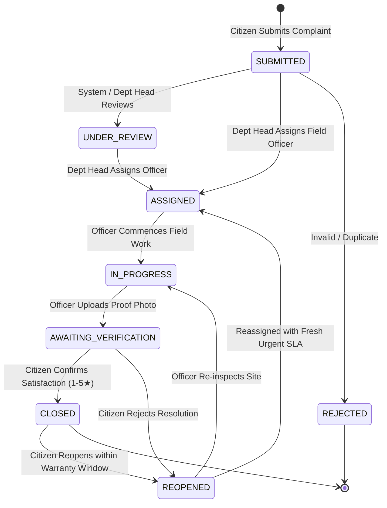

# JanSewa - Public Grievance Redressal & Civic SLA Monitoring Platform

A fullstack civic governance and municipal public grievance redressal platform engineered with strict accountability workflows, SLA deadline monitoring, cryptographic resolution proof verification, citizen reopen & escalation mechanics, and role-based access control (RBAC).

---

## 📁 Repository Directory Structure

```text
JanSewa-Complete/
├── backend/
│   ├── constants/             # Domain constants, roles, and status definitions
│   │   └── index.js           # Re-exports single source of truth
│   ├── controllers/           # HTTP request/response handlers only (extracts req, invokes service)
│   │   ├── analyticsController.js
│   │   ├── authController.js
│   │   ├── departmentController.js
│   │   ├── grievanceController.js
│   │   └── notificationController.js
│   ├── middleware/            # JWT authentication, RBAC, file upload validation, error handling
│   │   ├── authMiddleware.js  # Signature verification & session extraction (no backdoors)
│   │   ├── errorHandler.js    # Sanitized production error handler & HttpError class
│   │   ├── roleMiddleware.js  # Role-Based Access Control (RBAC) guard
│   │   └── uploadMiddleware.js# Extension/MIME allowlist check against Stored-XSS
│   ├── routes/                # Express route declarations (pure endpoint mapping)
│   │   ├── analyticsRoutes.js
│   │   ├── authRoutes.js
│   │   ├── departmentRoutes.js
│   │   ├── grievanceRoutes.js
│   │   ├── notificationRoutes.js
│   │   └── index.js
│   ├── services/              # Core domain business logic, state machine & data store queries
│   │   ├── analyticsService.js
│   │   ├── authService.js
│   │   ├── departmentService.js
│   │   ├── grievanceService.js
│   │   ├── notificationService.js
│   │   ├── slaService.js
│   │   └── stateMachine.js    # Strict lifecycle transition validator
│   ├── test/                  # Built-in node:test unit test suite
│   │   ├── slaService.test.js
│   │   └── stateMachine.test.js
│   ├── utils/                 # Server helper utilities
│   │   ├── helpers.js         # Unique complaint & log ID generators
│   │   └── token.js           # Secure JWT generation and verification
│   ├── prisma.js              # Central persistence gateway / repository abstraction
│   ├── db.js                  # Persistent DataStore engine with atomic JSON writes
│   ├── server.js              # Express app entry point with Helmet, CORS & graceful shutdown
│   ├── package.json
│   └── .env.example
│
├── frontend/
│   ├── api/                   # Dedicated API gateway functions (no inline fetch in views)
│   │   ├── analyticsApi.js
│   │   ├── authApi.js
│   │   ├── client.js          # Base HTTP client with JWT header & error normalization
│   │   ├── departmentApi.js
│   │   ├── grievanceApi.js
│   │   ├── notificationApi.js
│   │   └── index.js           # Re-exports unified gateway object
│   ├── components/            # Reusable UI components and modal containers
│   │   ├── common/            # StatusBadge, PriorityBadge, SLABadge, StatCard, Stepper, PhotoUploader
│   │   ├── grievance/         # ResolutionModal, VerificationModal, AssignModal
│   │   ├── layout/            # Navbar (with dev-gated switcher), Footer, PageLayout
│   │   └── notifications/     # NotificationDrawer
│   ├── context/               # AuthContext & NotificationContext
│   ├── pages/                 # Route-level view pages (code-split via React.lazy)
│   │   ├── admin/             # AdminDashboard, ComplaintMap (Leaflet GIS), AuditLogs
│   │   ├── auth/              # Login, Register
│   │   ├── citizen/           # CitizenDashboard, SubmitGrievance, MyGrievances, CitizenGrievanceDetail
│   │   ├── department/        # DepartmentDashboard, OfficerWorkload
│   │   ├── officer/           # OfficerDashboard
│   │   └── public/            # Home, Transparency, TrackPublic
│   ├── utils/                 # Client formatters and helpers
│   ├── App.jsx                # Main app router with lazy loading & RBAC protection
│   ├── main.jsx               # React 19 entry point
│   ├── index.css              # Custom municipal civic design system
│   ├── index.html
│   ├── vite.config.js         # Vite dev configuration with backend reverse proxy
│   └── package.json
│
├── package.json               # Root runner script (concurrently runs backend + frontend)
├── .gitignore                 # Excludes .env, uploads, runtime db.json, node_modules
└── README.md
```

---

## 🏛️ State Machine & Lifecycle Transitions

All grievance transitions are strictly governed by `backend/services/stateMachine.js`:



### Role Transition Matrix

| Action | Allowed Roles | Guard Conditions |
|---|---|---|
| **Submit Grievance** | `citizen`, `admin` | Valid subject, description, priority, category |
| **Assign Officer** | `department_head`, `admin` | Officer must belong to grievance department; Dept Head must belong to same dept |
| **Start Work** | `officer`, `admin` | Officer must be the assigned officer (`assignedOfficerId === user.id`) |
| **Submit Resolution** | `officer`, `admin` | Officer must be assigned; requires min 10-char summary + photographic evidence |
| **Verify Satisfaction** | `citizen`, `admin` | Caller must be grievance creator (`citizenId === user.id`); rating 1–5 |
| **Reopen Case** | `citizen`, `admin` | Caller must be creator; requires min 5-char reason; resets SLA deadline |

---

## 🔐 Security Hardening Summary

1. **No Backdoor Authentication**: Removed mock authentication headers and public role impersonation.
2. **Encrypted Passwords**: All user passwords stored as salted `bcrypt` hashes (`bcrypt.hashSync(pass, 10)`). Plain-text `rawPassword` properties are completely eliminated.
3. **Broken Object-Level Authorization (IDOR) Defenses**:
   - `GET /api/grievances/:id`: Verifies ownership for citizens, department match for officers/heads.
   - `GET /api/grievances`: Citizens receive only their own complaints.
   - `POST /api/grievances/:id/verify`: Only the complaint creator can verify satisfaction or reopen.
   - `POST /api/grievances/:id/resolve`: Only the assigned officer can upload resolution proof.
   - `PATCH /api/notifications/:id/read`: Only the notification owner can mark it as read.
   - `GET /api/analytics/audit-logs`: Restricted to `admin` and `department_head`.
4. **Stored-XSS File Upload Defense**:
   - Client-sent filenames and extensions are stripped and sanitized.
   - MIME types are mapped strictly to safe extensions (`image/jpeg` $\rightarrow$ `.jpg`, `image/png` $\rightarrow$ `.png`, `image/webp` $\rightarrow$ `.webp`).
   - Non-image files (e.g. `x.html`, `.svg`, `.exe`) are rejected with `400 Bad Request`.
   - Upload directory serves static files with `X-Content-Type-Options: nosniff`.
5. **Brute-Force & Denial-of-Service Mitigations**:
   - Rate limiting via `express-rate-limit` on `/api/auth/login` and `/api/auth/register`.
   - Security response headers via `helmet`.
   - Body parser payload size capped at 1 MB.
   - Protected database wipe endpoint (`/api/reset-data`) requiring admin privileges and disabled in production.

---

## 👥 Seed Demo Credentials

All seed accounts use the default password: **`password123`**

| Role | Name | Email | Department |
|---|---|---|---|
| **Citizen** | Palak Rathod | `palak.rathod@example.com` | Public Citizen (Ward 1) |
| **Citizen** | Aarav Mehta | `aarav.mehta@example.com` | Public Citizen (Ward 4) |
| **Field Officer** | Rahul Sharma | `rahul.sharma@pwd.gov.in` | Roads & Infrastructure |
| **Field Officer** | Amit Vernekar | `amit.vernekar@sanitation.gov.in` | Sanitation & Solid Waste |
| **Field Officer** | Suresh More | `suresh.more@water.gov.in` | Water Supply & Sewage |
| **Field Officer** | Vinay Nair | `vinay.nair@electrical.gov.in` | Street Lighting & Electricity |
| **Dept Head** | Ramesh Kulkarni | `pwd@jansewa.gov.in` | Roads & Infrastructure |
| **Dept Head** | Sneha Iyer | `sanitation@jansewa.gov.in` | Sanitation & Solid Waste |
| **Dept Head** | Vikas Patil | `water@jansewa.gov.in` | Water Supply & Sewage |
| **Dept Head** | Pooja Deshmukh | `electrical@jansewa.gov.in` | Street Lighting & Electricity |
| **Chief Admin** | Admin Officer | `admin@jansewa.gov.in` | Municipal Commissioner |

---

## 📡 REST API Specification

### Authentication (`/api/auth`)
- `POST /api/auth/register` – Register citizen account (validates email regex, min 8-char password)
- `POST /api/auth/login` – Authenticate with email & password (rate-limited, returns signed JWT)
- `GET /api/auth/me` – Retrieve profile for currently authenticated user

### Grievances (`/api/grievances`)
- `GET /api/grievances/track/:complaintId` – Public tracking view (masks citizen/officer personal contact info)
- `GET /api/grievances` – Role-scoped grievance listing
- `GET /api/grievances/:id` – Detailed grievance inspection with SLA information (enforces IDOR)
- `POST /api/grievances` – File new grievance with up to 5 photos (`evidence` field)
- `PATCH /api/grievances/:id/status` – Advance status through state machine
- `POST /api/grievances/:id/assign` – Assign field officer (`department_head`, `admin`)
- `POST /api/grievances/:id/resolve` – Submit resolution with photo proof (`officer`, `admin`)
- `POST /api/grievances/:id/verify` – Verify citizen satisfaction or reopen case (`citizen`, `admin`)
- `POST /api/grievances/:id/reopen` – Direct citizen reopen endpoint (`citizen`, `admin`)

### Analytics & GIS (`/api/analytics`)
- `GET /api/analytics/dashboard` – Role-scoped KPI metrics and accurate SLA compliance rate
- `GET /api/analytics/map` – GeoJSON-compatible ward grievance coordinates for Leaflet GIS map
- `GET /api/analytics/audit-logs` – Tamper-evident civic action log (`admin`, `department_head`)

### Notifications (`/api/notifications`)
- `GET /api/notifications` – Fetch notifications for authenticated user
- `PATCH /api/notifications/:id/read` – Mark notification as read (enforces ownership)
- `POST /api/notifications/mark-all-read` – Mark all user notifications as read

---

## 🧪 Testing

The test suite uses Node.js's native `node:test` and `node:assert` runner (no extra dependencies required).

```bash
# Run unit tests
npm test
```

Test coverage includes:
- Sequential lifecycle transitions (`SUBMITTED` $\rightarrow$ `ASSIGNED` $\rightarrow$ `IN_PROGRESS` $\rightarrow$ `AWAITING_VERIFICATION` $\rightarrow$ `CLOSED`)
- Rejection of no-op transitions and illegal state skips
- Role-based transition authorization guards (`isAssignee`, `isCreator`)
- SLA deadline projection and overdue calculation for active & completed complaints
- Automated batch SLA overdue detection

---

## 🚀 Getting Started

### Prerequisites
- Node.js v18.0.0 or higher
- npm v9.0.0 or higher

### 1. Install Dependencies
```bash
npm run install:all
```

### 2. Configure Environment
```bash
# Backend configuration
cp backend/.env.example backend/.env
```

### 3. Run Development Server
```bash
npm run dev
```

- **Frontend Client**: [http://localhost:5173](http://localhost:5173)
- **Backend API**: [http://localhost:5000](http://localhost:5000)
- **Healthcheck**: [http://localhost:5000/api/health](http://localhost:5000/api/health)

---

## ⚠️ Known Architectural Trade-offs & Prototype Scope

1. **Storage Engine**: This prototype uses an atomic JSON datastore (`backend/db.js`) with temp-file writes and atomic renames to ensure a self-contained, zero-dependency setup without requiring an external PostgreSQL or MongoDB instance. All operations are isolated inside the `DatabaseStore` / `prisma.js` repository pattern, making migration to PostgreSQL with Prisma an isolated change to that single file.
2. **Notification Dispatch**: Notifications are in-app and persisted in the local datastore. In a production deployment, this would be wired to an SMS gateway (e.g. Twilio) and SMTP mailer.
3. **Session Storage**: JWT tokens are persisted in browser `localStorage` for frictionless client demo state management.
