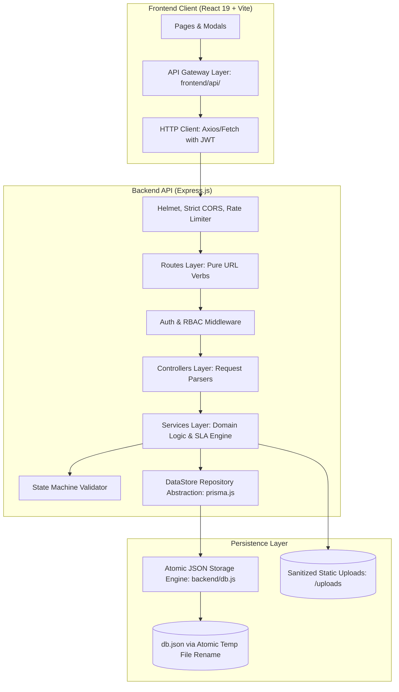
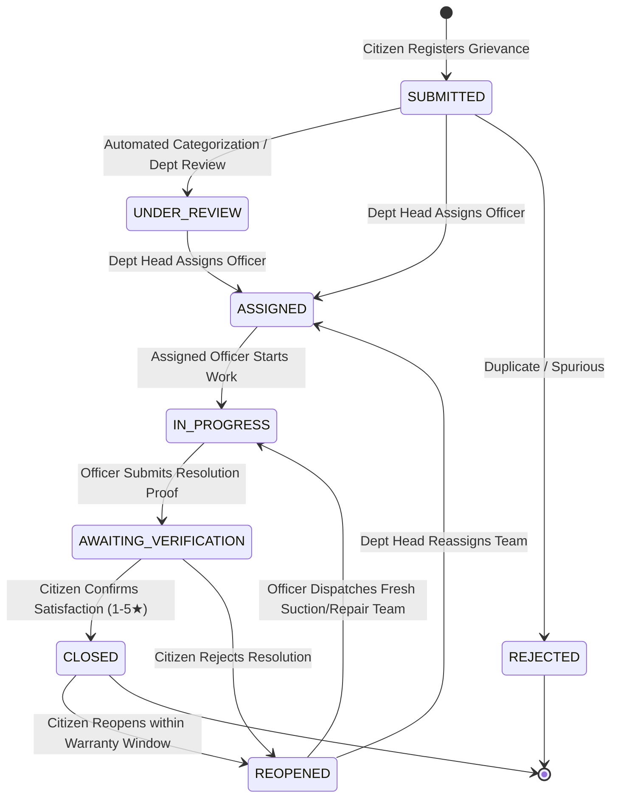

# 🏛️ JanSewa – Public Grievance Redressal & Civic SLA Monitoring Platform

A production-grade, fullstack civic governance system engineered for Indian municipal corporations (modeled after civic bodies like BMC / MBMC). JanSewa streamlines citizen complaint registration, enforces strict time-bound Service Level Agreements (SLAs), requires photographic resolution proof from field officers, empowers citizens with a verification/reopen accountability loop, and provides municipal leadership with an interactive GIS heatmap and tamper-evident audit logs.

---

## 🌟 Key Features & Role Capabilities

### 🧑 1. Citizen Portal
- **Smart Grievance Submission**: File civic complaints across Roads, Sanitation, Water Supply, and Street Lighting.
- **Dual Photo Evidence**: Capture photos directly through device camera (`navigator.mediaDevices.getUserMedia`) or upload existing image files.
- **Auto-Geotagging**: Captures browser GPS coordinates (latitude/longitude) and landmark address.
- **Live SLA Countdown**: Visual badges show SLA target deadline, hours remaining, or overdue status.
- **Verification & Rating**: When an officer marks a case resolved, the citizen must inspect proof and either:
  - **Confirm Satisfaction**: Close case with a 1 to 5-star rating and written review.
  - **Reject & Reopen**: Reopen the grievance with a mandatory rejection explanation, instantly triggering automated departmental escalation and a fresh SLA window.
- **Real-Time Notifications**: Instant updates when an officer is assigned, field work commences, or resolution proof is submitted.

### 👷 2. Field Officer Workspace
- **Personalized Work Queue**: View cases assigned specifically to the logged-in officer or department queue.
- **Urgency Triage**: Instant KPI filters for Overdue SLA Cases, Cases Due Soon (< 12 hours), and High/Critical Priority.
- **One-Click Case Acceptance**: Transition grievances from `ASSIGNED` to `IN_PROGRESS` when deploying teams.
- **Mandatory Photographic Resolution Proof**: Officers must submit a work summary (minimum 10 characters) and on-site completion photos (via live device camera or file upload) to transition the case to `AWAITING_VERIFICATION`.

### 👔 3. Department Head Command
- **Workload Balancing**: Real-time officer roster showing active cases, overdue counts, and workload health (`Optimal`, `Medium`, `High`).
- **Targeted Officer Assignment**: Assign unassigned complaints to specific field officers within the department.
- **Escalation Management**: Immediate visibility into citizen-reopened cases and SLA breaches for administrative intervention.

### 🏛️ 4. Chief Administrator & Leadership
- **City-Wide KPI Dashboard**: Real-time tracking of Total Grievances, In-Progress Work, Awaiting Verification, Overdue Cases, Escalated Cases, and True SLA Compliance %.
- **Interactive GIS Heatmap & Ward Map**: Built with Leaflet OpenStreetMap to visualize civic problem hotspots across municipal wards, color-coded by priority and urgency.
- **Tamper-Evident Civic Audit Logs**: Immutable historical event stream logging actor, role, action, previous status, new status, and timestamp.
- **Controlled Demo Reset**: Administrative utility to reset seed data to default realistic municipal records (strictly disabled in production).

### 🌐 5. Public Transparency & Docket Tracking
- **Anonymous Docket Tracking**: Citizens can track any complaint (`GRV-YYYY-XXXXX`) without logging in.
- **Privacy-Preserving Public View**: Automatically masks personal citizen and officer contact info (phone/email) and full names from public inspection while displaying verified resolution photos and timeline steps.
- **City Performance Transparency**: Public scorecard showing department-by-department resolution rates, active cases, and average turnaround hours.

---

## 🏗️ System Architecture

JanSewa follows a decoupled, 3-tier modular architecture designed for high maintainability, testability, and security.



---

## 🏛️ State Machine & Lifecycle Transitions

All state transitions are strictly governed by [backend/services/stateMachine.js](file:///c:/Users/DEV/Documents/Coding/SE%20Project/JanSewa-Complete/backend/services/stateMachine.js). Direct status bypasses and no-op updates are strictly rejected.



### Role Transition Rules

| Action | Allowed Roles | Guard Conditions |
|---|---|---|
| **Submit Grievance** | `citizen`, `admin` | Valid subject, description, priority, category |
| **Assign Officer** | `department_head`, `admin` | Officer must belong to grievance department; Dept Head must belong to same dept |
| **Start Work** | `officer`, `admin` | Caller must be the assigned officer (`assignedOfficerId === user.id`) |
| **Submit Resolution** | `officer`, `admin` | Caller must be the assigned officer; requires min 10-char summary + photographic proof |
| **Verify Satisfaction** | `citizen`, `admin` | Caller must be grievance creator (`citizenId === user.id`); rating 1–5 |
| **Reopen Case** | `citizen`, `admin` | Caller must be creator; requires min 5-char reason; recalculates fresh SLA window |

---

## 📁 Repository Directory Structure

```text
JanSewa-Complete/
├── backend/
│   ├── constants/             # Domain constants, roles, and status definitions
│   │   └── index.js           # Single source of truth for statuses, priorities, and roles
│   ├── controllers/           # HTTP request/response handlers only (extracts req, calls service)
│   │   ├── analyticsController.js
│   │   ├── authController.js
│   │   ├── departmentController.js
│   │   ├── grievanceController.js
│   │   └── notificationController.js
│   ├── middleware/            # JWT authentication, RBAC, file upload validation, error handling
│   │   ├── authMiddleware.js  # Cryptographic JWT verification (no backdoor headers)
│   │   ├── errorHandler.js    # Central error handler, HttpError class, and asyncHandler
│   │   ├── roleMiddleware.js  # Role-Based Access Control (RBAC) guard
│   │   └── uploadMiddleware.js# Extension & MIME allowlist validator against Stored-XSS
│   ├── routes/                # Express route declarations (pure endpoint mappings)
│   │   ├── analyticsRoutes.js
│   │   ├── authRoutes.js
│   │   ├── departmentRoutes.js
│   │   ├── grievanceRoutes.js
│   │   ├── notificationRoutes.js
│   │   └── index.js           # Central API aggregator
│   ├── services/              # Core domain business logic, state machine & database queries
│   │   ├── analyticsService.js# Dashboard statistics, map markers & audit logs
│   │   ├── authService.js     # User registration, bcrypt authentication, profile retrieval
│   │   ├── departmentService.js# Department roster & officer workload calculations
│   │   ├── grievanceService.js# Lifecycle workflow, IDOR checks, resolution & verification
│   │   ├── notificationService.js# In-app notifications & read state tracking
│   │   ├── slaService.js      # Deadline projections, overdue calculations & background batch checks
│   │   └── stateMachine.js    # Strict status transition matrix & permission validator
│   ├── test/                  # Built-in node:test unit test suite
│   │   ├── slaService.test.js # Tests for deadlines, overdue calculations & compliance
│   │   └── stateMachine.test.js# Tests for valid transitions, no-op rejection & role guards
│   ├── utils/                 # Server helper utilities
│   │   ├── helpers.js         # Unique collision-free complaint ID & log ID generators
│   │   └── token.js           # Secure JWT generation, secret management & verification
│   ├── prisma.js              # Persistence abstraction layer (Repository pattern for DB portability)
│   ├── db.js                  # Persistent DataStore engine with atomic temp-file JSON writes
│   ├── server.js              # Express app entry point with Helmet, CORS & graceful shutdown
│   ├── package.json           # Backend dependencies and test scripts
│   └── .env.example           # Example environment configuration
│
├── frontend/
│   ├── api/                   # Dedicated client API gateway layer (zero inline fetch calls)
│   │   ├── analyticsApi.js    # Statistics, map markers, audit logs
│   │   ├── authApi.js         # Login, register, profile, session management
│   │   ├── client.js          # Base HTTP client with JWT header attachment & error unwrapping
│   │   ├── departmentApi.js   # Department listing, officer roster
│   │   ├── grievanceApi.js    # Grievance CRUD, assignments, proof upload, verification
│   │   ├── notificationApi.js # In-app notification queries & mark-read
│   │   └── index.js           # Unified API gateway export
│   ├── components/            # Reusable UI components and modal dialogs
│   │   ├── common/            # StatusBadge, PriorityBadge, SLABadge, StatCard, Stepper, PhotoUploader
│   │   ├── grievance/         # ResolutionModal, VerificationModal, AssignModal
│   │   ├── layout/            # Navbar (with dev-mode role switcher), Footer, PageLayout
│   │   └── notifications/     # NotificationDrawer (anchored with click-outside listener)
│   ├── context/               # AuthContext & NotificationContext
│   ├── pages/                 # Route-level view pages (code-split via React.lazy)
│   │   ├── admin/             # AdminDashboard, ComplaintMap (Leaflet GIS), AuditLogs
│   │   ├── auth/              # Login, Register
│   │   ├── citizen/           # CitizenDashboard, SubmitGrievance, MyGrievances, CitizenGrievanceDetail
│   │   ├── department/        # DepartmentDashboard, OfficerWorkload
│   │   ├── officer/           # OfficerDashboard
│   │   └── public/            # Home, Transparency, TrackPublic
│   ├── utils/                 # Client formatters and helpers
│   ├── App.jsx                # Main app router with lazy loading & RBAC protection
│   ├── main.jsx               # React 19 entry point
│   ├── index.css              # Custom municipal civic design system
│   ├── index.html
│   ├── vite.config.js         # Vite dev configuration with backend reverse proxy
│   └── package.json           # Frontend dependencies
│
├── package.json               # Root workspace configuration (concurrently runs backend + frontend)
├── .gitignore                 # Excludes .env, uploads, runtime db.json, node_modules
└── README.md
```

---

## 🔐 Security Architecture & Hardening

| Vulnerability Addressed | Implementation Defense |
|---|---|
| **Authentication Backdoors** | All bypasses (e.g. `demo-user-` tokens) removed. All requests authenticate via cryptographically signed JWTs using `jsonwebtoken`. |
| **Insecure Direct Object Reference (IDOR)** | Server-side `assertCanView` enforces ownership: Citizens can only query their own complaints; Officers can only view assigned or departmental complaints; Dept Heads can only view their department. |
| **Tampering with Grievance State** | `verifyResolution` strictly requires `g.citizenId === user.id`; `resolveWithProof` strictly requires `g.assignedOfficerId === user.id`. Status skips are blocked by the state machine. |
| **Stored-XSS File Uploads** | `uploadMiddleware.js` uses an allowlist (`.jpg`, `.jpeg`, `.png`, `.webp`) and forces safe extensions matching validated MIME types (disguised `.html` or `.exe` uploads are rejected with HTTP 400). Static uploads are served with `X-Content-Type-Options: nosniff`. |
| **Password Security** | All passwords hashed using salted `bcrypt` (`bcrypt.hashSync(pass, 10)`). Plain-text password properties (`rawPassword`) are completely eradicated. |
| **Brute-Force & Denial of Service** | `express-rate-limit` limits login/registration to 40 attempts per 15 minutes. `helmet` configures HTTP security headers. Body parser is limited to 1 MB. |
| **Data Integrity & Race Conditions** | `DatabaseStore.save()` performs atomic file writes via temporary files (`db.json.*.tmp`) followed by atomic filesystem renames (`fs.renameSync`) to eliminate corruption during server restarts. |

---

## 👥 Demo Personas & Test Credentials

All seed accounts share the default password: **`password123`**

| Role | Persona Name | Email | Department / Scope |
|---|---|---|---|
| **Citizen** | Palak Rathod | `palak.rathod@example.com` | Registered Citizen (Bhayandar West) |
| **Citizen** | Aarav Mehta | `aarav.mehta@example.com` | Registered Citizen (Mira Road East) |
| **Field Officer** | Rahul Sharma | `rahul.sharma@pwd.gov.in` | Assistant Municipal Engineer (Roads) |
| **Field Officer** | Amit Vernekar | `amit.vernekar@sanitation.gov.in` | Sanitary Inspector - Ward 4 |
| **Field Officer** | Suresh More | `suresh.more@water.gov.in` | Junior Water Works Engineer |
| **Field Officer** | Vinay Nair | `vinay.nair@electrical.gov.in` | Electrical Maintenance In-Charge |
| **Department Head** | Ramesh Kulkarni | `pwd@jansewa.gov.in` | Executive Engineer (Roads) |
| **Department Head** | Sneha Iyer | `sneha.iyer@sanitation.gov.in` | Chief Sanitation Officer |
| **Department Head** | Vikas Patil | `water@jansewa.gov.in` | Executive Engineer (Water Works) |
| **Department Head** | Pooja Deshmukh | `electrical@jansewa.gov.in` | Chief Electrical Inspector |
| **Chief Administrator** | Municipal Admin | `admin@jansewa.gov.in` | Public Grievance Commissioner |

---

## 📡 REST API Reference

### Authentication (`/api/auth`)
| Method | Endpoint | Access | Description |
|---|---|---|---|
| `POST` | `/api/auth/register` | Public | Register new citizen account (validates email & min 8-char password) |
| `POST` | `/api/auth/login` | Public | Authenticate with email & password (rate-limited, returns signed JWT) |
| `POST` | `/api/auth/switch-role` | Dev Only | 1-click test role switcher (disabled in production) |
| `GET` | `/api/auth/me` | Authenticated | Retrieve current user profile |

### Grievances (`/api/grievances`)
| Method | Endpoint | Access | Description |
|---|---|---|---|
| `GET` | `/api/grievances/track/:complaintId` | Public | Public tracking docket with privacy-masked timeline |
| `GET` | `/api/grievances` | Authenticated | Scoped complaint listing (Citizens: own; Officers: assigned/dept; Admin: all) |
| `GET` | `/api/grievances/:id` | Authenticated | Detailed complaint inspection with SLA status (enforces IDOR) |
| `POST` | `/api/grievances` | `citizen`, `admin` | File complaint with up to 5 photos (`evidence` field) |
| `PATCH` | `/api/grievances/:id/status` | Authenticated | Transition status through state machine |
| `POST` | `/api/grievances/:id/assign` | `dept_head`, `admin` | Assign field officer within department |
| `POST` | `/api/grievances/:id/resolve` | `officer`, `admin` | Submit resolution summary + photo proof (`proofFiles` field) |
| `POST` | `/api/grievances/:id/verify` | `citizen`, `admin` | Verify citizen satisfaction (1-5★) or reopen case |
| `POST` | `/api/grievances/:id/start-work` | `officer`, `admin` | Transition assigned complaint to `IN_PROGRESS` |
| `POST` | `/api/grievances/:id/reopen` | `citizen`, `admin` | Direct citizen reopen endpoint (triggers escalation & fresh SLA) |

### Analytics & GIS (`/api/analytics`)
| Method | Endpoint | Access | Description |
|---|---|---|---|
| `GET` | `/api/analytics/dashboard` | Public / Scoped | Role-scoped KPI metrics and true SLA compliance rate |
| `GET` | `/api/analytics/map` | Public / Scoped | GeoJSON-compatible ward markers for Leaflet GIS map |
| `GET` | `/api/analytics/audit-logs` | `admin`, `dept_head` | Tamper-evident civic action audit trail |

### Notifications (`/api/notifications`)
| Method | Endpoint | Access | Description |
|---|---|---|---|
| `GET` | `/api/notifications` | Authenticated | Fetch notifications for logged-in user |
| `PATCH` | `/api/notifications/:id/read` | Authenticated | Mark notification read (enforces ownership) |
| `POST` | `/api/notifications/mark-all-read` | Authenticated | Mark all notifications read for caller |

---

## 🧪 Unit Testing Suite

JanSewa includes a zero-dependency test suite utilizing Node.js's native `node:test` and `node:assert` runner:

```bash
npm test
```

### Test Coverage Highlights:
- **State Machine Transitions**: Validates complete lifecycle paths (`SUBMITTED` $\rightarrow$ `ASSIGNED` $\rightarrow$ `IN_PROGRESS` $\rightarrow$ `AWAITING_VERIFICATION` $\rightarrow$ `CLOSED`).
- **No-Op Transition Rejection**: Guarantees identical status transitions are rejected to prevent audit spam.
- **Role Transition Authorization**: Enforces `isAssignee` for field officers and `isCreator` for citizens.
- **SLA Calculation & Evaluation**: Tests dynamic category/priority deadlines, overdue detection, and late resolution tracking.
- **Batch SLA Worker**: Verifies automated overdue flagging for background scheduler runs.

---

## 🚀 Setup & Installation Guide

### Prerequisites
- **Node.js**: v18.0.0 or higher (v20+ recommended)
- **npm**: v9.0.0 or higher

### 1. Clone the Repository
```bash
git clone https://github.com/DevSolanki13/Public-Grivance-System.git
cd Public-Grivance-System
```

### 2. Install All Dependencies (Single Command)
Because the project is configured with **npm workspaces**, running `npm install` at the root automatically installs dependencies for both backend and frontend:
```bash
npm install
```

### 3. Environment Configuration
The backend comes pre-configured with development defaults. To customize:
```bash
cp backend/.env.example backend/.env
```

Default configuration in `backend/.env`:
```env
PORT=5000
NODE_ENV=development
JWT_SECRET=jansewa_dev_secret_key_random_long_secure_token_2026_x89f
CORS_ORIGIN=http://localhost:5173
```

### 4. Run the Development Server
Start both Backend and Frontend concurrently with a single command:
```bash
npm run dev
```

- **Frontend Application**: [http://localhost:5173](http://localhost:5173)
- **Backend API**: [http://localhost:5000](http://localhost:5000)
- **API Healthcheck**: [http://localhost:5000/api/health](http://localhost:5000/api/health)

### 5. Build for Production
```bash
npm run build
```
Vite compiles and chunks the frontend into optimized static assets in `frontend/dist/` (with route-level code splitting keeping main bundle under 270 kB).

---

## 🎓 Evaluator & Oral Defense FAQ

### Q1: Why use an atomic JSON datastore instead of MongoDB or PostgreSQL?
> **Answer**: For an academic/prototype submission, self-contained portability is critical: evaluators can clone and run the application instantly without configuring a local PostgreSQL or MongoDB instance. The architecture adheres to the **Repository Pattern** through `prisma.js` and `db.js`. All database operations are cleanly encapsulated in static service layers, meaning migrating to PostgreSQL with Prisma requires changing only the data adapter in `db.js`, without altering any controller, route, or UI code.

### Q2: How is Insecure Direct Object Reference (IDOR) prevented?
> **Answer**: Every controller passes `req.user` into the service layer. The service layer invokes `assertCanView(user, grievance)`, which inspects ownership:
> - Citizens are strictly forbidden from viewing or modifying grievances where `g.citizenId !== user.id`.
> - Officers can only resolve or progress grievances assigned to them (`g.assignedOfficerId === user.id`).
> - Department Heads can only assign grievances within their department (`g.departmentId === user.departmentId`).

### Q3: How does the SLA escalation mechanism operate?
> **Answer**: When a complaint is filed, `slaHours` is computed based on both department category SLA and priority urgency (Critical = 24h, High = 48h). A background scheduler evaluates active complaints every 2 minutes. If a deadline breaches, `isOverdue` and `isEscalated` flags are automatically asserted. Furthermore, when a citizen rejects a resolution, the case transitions to `REOPENED`, resets the deadline with a fresh urgent window, and notifies the Department Head.

### Q4: How is Stored-XSS prevented in file uploads?
> **Answer**: `uploadMiddleware.js` uses an allowlist of image MIME types and extensions (`.jpg`, `.jpeg`, `.png`, `.webp`). Even if an attacker uploads a malicious file `payload.html` disguised with MIME `image/png`, the middleware forces the extension to match the validated image type. Files are saved in a dedicated `uploads/` folder served with `X-Content-Type-Options: nosniff`.

---

## 📄 License
This project was developed for educational and civic governance demonstration purposes under the **MIT License**.
